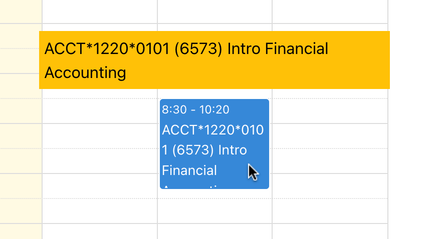

# 3760project

## Description
This is our custom made course scheduler for CIS3760. You can access it by clicking this link: https://cis3760team105.live/.

External IP: 34.130.250.108

**Note:**

See our 'Wiki' section in our web application which contains information on the features/functionalities present and how to use them.

Hovering over an event (i.e. a course added in the scheduler) will display the course's full name.
Example:

## How to run
See [running instructions docs](https://gitlab.socs.uoguelph.ca/cis3760team105/3760project/-/blob/Sprint9/docs/running_full_stack_app.md) which contains comprehensive documentation on how to run our program for Windows, MacOS, and Linux.

## How to run tests (for both frontend and backend)
See [testing code docs](https://gitlab.socs.uoguelph.ca/cis3760team105/3760project/-/blob/Sprint9/docs/testing_python_code.md).
